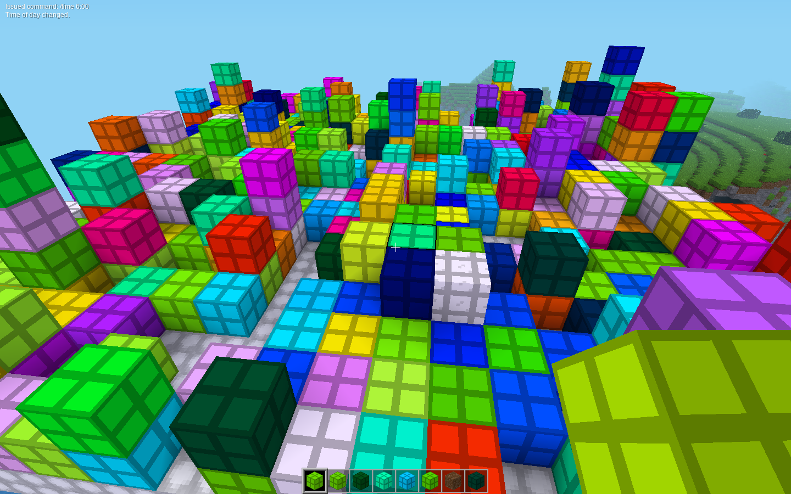
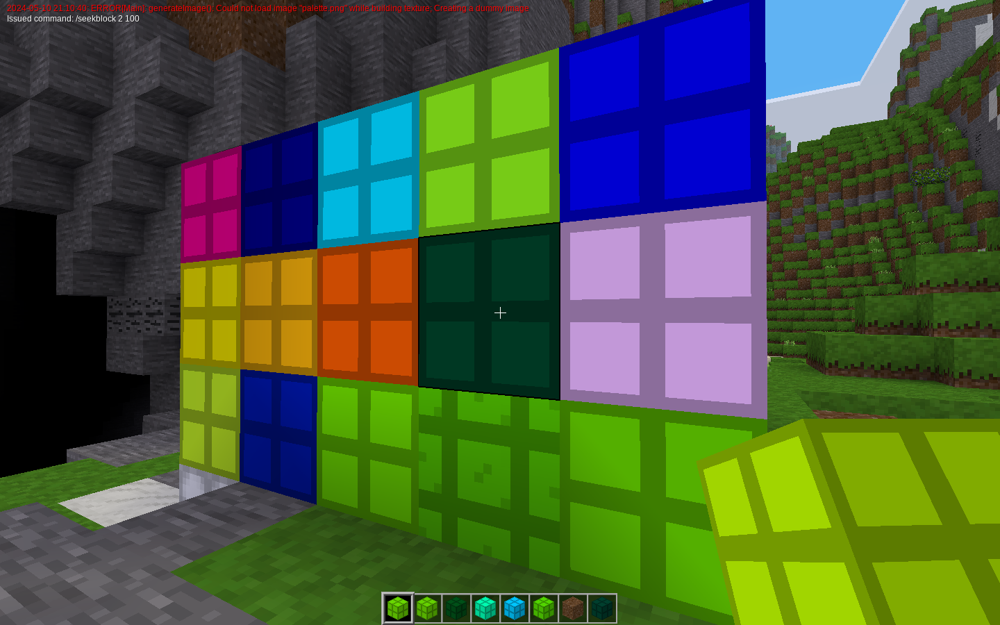

# Seekblock Intro
Little mini-game as a stand-alone mod. The goal is to find the one block that has a different texture. When someone digs that block, the game cleans itself up, and rewards the winner with some particle effects.






# Usage
Usage via chat command:

```
/seekblock <size> <percent_filled> <timeout in minutes>
```

For example, the images above were made using:

```
/seekblock 10 10
/seekblock 2 100
```

Giving up? Either wait or use:

```
/seekblockclear
```

Note: Size is the 'half width... sorta'. If size = N, then the game area extents are (x,y,z) = (2N +1, N, 2N+1)

# Features
* no spamming -- each player can only have one active seekblock game going at one time (in theory...)
* timeout -- Maximum game length is 10 minutes, after that it cleans itself up if there's no winner
* max size -- Maximum number of blocks is limited to 512 (roughly... statistically)
* max extents -- maximum game size is limited to 65 x 32 x 65 area
* no blocks on top of players -- no one gets buried
* half the time it's fun every time -- guaranteed for a few minutes anyway (in theory...)

# TODOs
* [x] I need to fix a bug where the timeout from a previous game cleans up an active game
* [ ] Some more play testing to find bugs and ways to be annoying
* [ ] There may be game elements that I didn't account for that will prevent the cleanup efforts or make the game unwinnable
* [ ] Better rewards -- I haven't really figured out the particle system

# Questions
* Should the nodes be falling or floating? Which is more fun? (Floating gives a parkour aspect... maybe?)
* Should I just pick settings that are fun? Or is the size/percent_filled fun to have around for different game types?
* Is the hidden block too hard / too easy / just hard enough to find?
* Any other suggestions to make this releasable?
